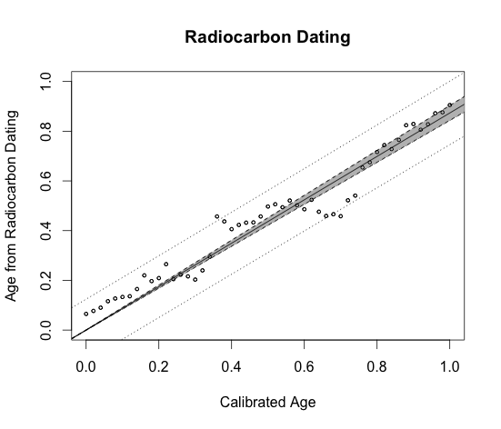

[](http://quantlet.de/index.php?p=info)

## [](http://quantlet.de/) **plotLMR** [](http://quantlet.de/d3/ia)

```yaml

Name of Quantlet : plotLMR

Published in : plotting

Description : 'Plots the regression line with a 95% confidence interval and a shaded 95% prediction
interval.'

Keywords : 'plot, visualization, scatterplot, linear-regression, confidence-interval, graphical
representation'

Author[New] : Ludgar Evers

Submitted : Mon, November 10 2014 by Anne Israel

Datafile : a2.RData

Input: 
- cal.age: calibrated age in thousand years BC
- rc.age: age obtained from radiocarbon dating in thousand years BC of 52 species

```




```r

# clear history
rm(list = ls(all = TRUE))
graphics.off()

load("a2.RData")

# scatterplot of rc.age against cal.age with labelled axis
plot(rc$cal.age, rc$rc.age, xlim = c(0, 1), ylim = c(0, 1), xlab = "Calibrated Age", ylab = "Age from Radiocarbon Dating", 
    main = "Radiocarbon Dating", cex = 0.5)

# added regression line
abline(0, 0.8735)

# 95% confidence interval with dashed lines
abline(0, 0.8438, lty = 2)
abline(0, 0.9031, lty = 2)

# 95% prediction interval with dotted lines Confidence bounds are not linear. Thus we first create a
# sequence with 100 numbers spread out over the range of dist, and then evaluate the lower bound and
# upper bound for this sequence.
a     = seq(-0.1, 1.1, length.out = 100)
upper = 0.8735 * a + 0.02968 * sqrt(17.5 + a^2)
lower = 0.8735 * a - 0.02968 * sqrt(17.5 + a^2)
lines(a, upper, lty = 3)
lines(a, lower, lty = 3)

# to shade the area we need to draw a triangle using the polygon function
triangle = rbind(c(0, 0), c(1.1, 0.8437 * 1.1), c(1.1, 0.9031 * 1.1))
polygon(triangle, lty = 2, col = "grey")

# we need to redraw the data points and lines which are covered by the polygon
points(rc$cal.age, rc$rc.age, cex = 0.5)
abline(0, 0.8735)

```
