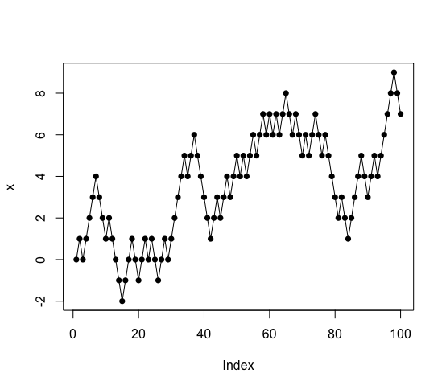

[](http://quantlet.de/index.php?p=info)

## [](http://quantlet.de/) **simulationplot** [](http://quantlet.de/d3/ia)

```yaml

Name of Quantlet : simulationplot

Published in : plotting

Description : Plots the first 100 simulated values of a random walk.

Keywords : 'plot, visualization, graphical representation, simulation, random-walk,
stochastic-process'

Author [New] : Ludgar Evers

Submitted : Mon, November 10 2014 by Anne Israel

```




```r

# clear history
rm(list = ls(all = TRUE))
graphics.off()

n     = 100
x     = numeric(n)              #create empty vector to hold result
x[1]  = 0                       #set first entry to 0 (is already 0)

for (i in 2:n) {
    e    = sample(c(-1,1), 1)
    x[i] = x[i-1] + e           #draw the others (2nd onwards) using the conditional distribution 
}

plot(x, type="o", pch=16)       #visualize the results

```
