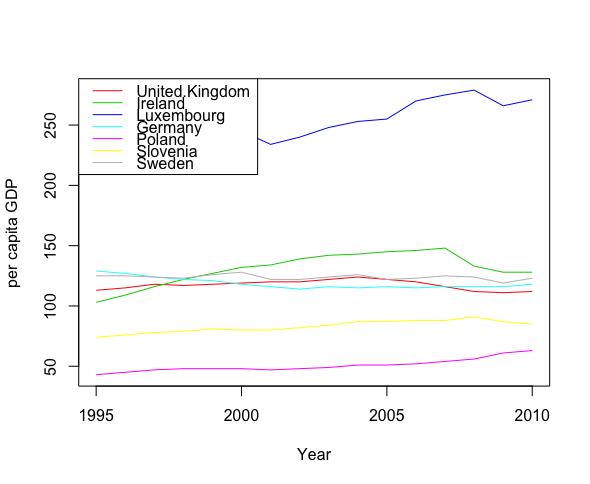
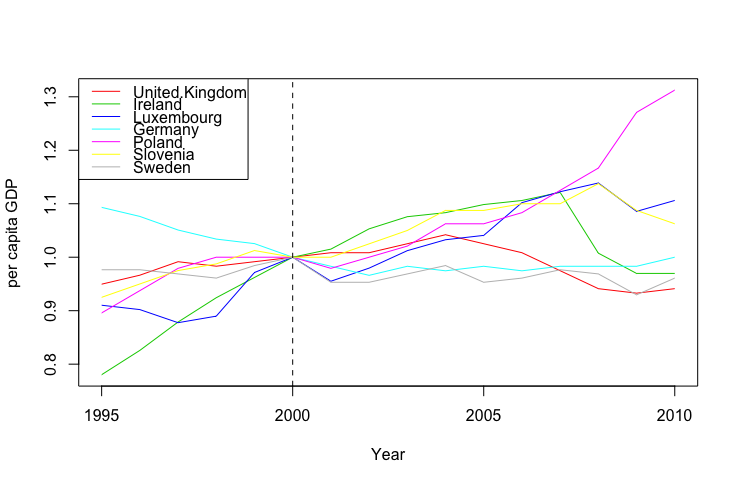

[](http://quantlet.de/index.php?p=info)

## [](http://quantlet.de/) **timeseries** [](http://quantlet.de/d3/ia)

```yaml

Name of Quantlet : timeseries

Published in : plotting

Description : 'Plots the per capita GDP in different countries over a time-series. In a second step
data will be normalized and plotted.'

Keywords : plot, visualization, graphical representation, normalization, time-series, financial

Author[New] : Ludgar Evers

Submitted : Mon, November 10 2014 by Anne Israel

Datafile : a2.RData

```







```r

# clear history
rm(list = ls(all = TRUE))
graphics.off()

# load data
load("a2.RData")

# plot of the per-capita GDP in the UK from 1995 to 2010
plot(EU$Year, EU$United.Kingdom, type = "l", xlab = "Year", ylab = "per capita GDP", 
    main = "Per capita GDP in PPS (UK)")

dev.new()
# plot the data for all countries available in the data set either use the function matplot
matplot(EU$Year, EU[, -1], col = 2:ncol(EU), type = "l", lty = 1, xlab = "Year", ylab = "per capita GDP")
legend("topleft", lty = 1, col = 2:ncol(EU), colnames(EU)[-1])

# or construct the plot step by step
range.Y  = range(EU[, -1])
plot(EU$Year, EU$United.Kingdom, type = "n", xlab = "Year", ylab = "per capita GDP", 
    ylim = range.Y)
for (i in 2:ncol(EU)) lines(EU$Year, EU[, i], col = i)
legend("topleft", lty = 1, col = 2:ncol(EU), colnames(EU)[-1])

# for comparing the data normalize the data by dividing the time series for each
# country by the per capita GDP recorded for that country in the year 2000.
EU.normalized = EU
for (i in 2:ncol(EU.normalized)) EU.normalized[, i] = EU.normalized[, i]/EU.normalized[6,i]  
#with the function sweep you can do it more efficiently

dev.new()
# plot the normalized data
matplot(EU.normalized$Year, EU.normalized[, -1], col = 2:ncol(EU.normalized), type = "l", 
    lty = 1, xlab = "Year", ylab = "per capita GDP")
legend("topleft", lty = 1, col = 2:ncol(EU.normalized), colnames(EU.normalized)[-1])
abline(v = 2000, lty = 2) 

```
